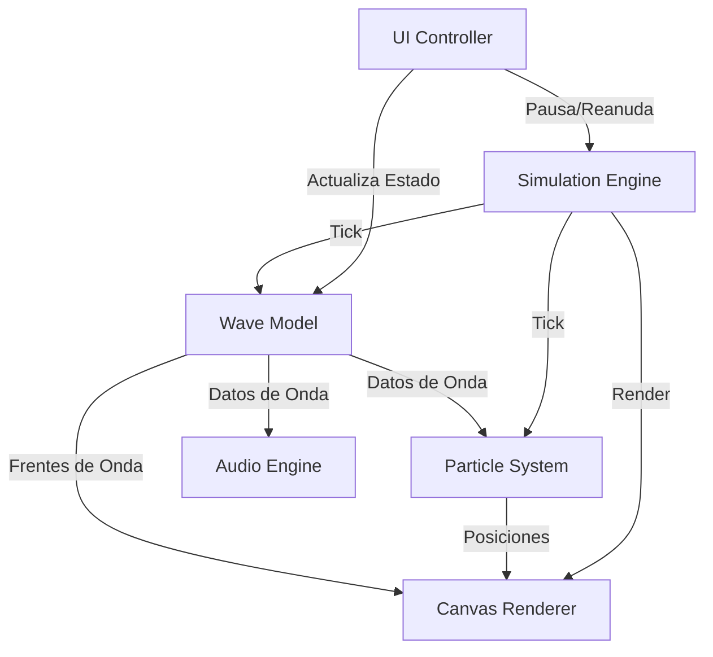

# 02. Arquitectura General del Sistema

## Introducción
Este documento describe la arquitectura de software propuesta para el simulador de ondas sonoras. Para cumplir con el requisito de baja complejidad y alta eficiencia, se ha optado por un diseño modular basado en TypeScript puro, sin frameworks que añadan sobrecarga.

## Módulos del Sistema

El sistema se divide en los siguientes componentes principales:

1. **SimulationEngine (Motor de Simulación):** Controla el bucle de animación (`requestAnimationFrame`), calcula el *delta time* y coordina la actualización de la física y el renderizado.
2. **WaveModel (Modelo de Onda):** Contiene el estado físico de la onda (frecuencia, amplitud, velocidad) y calcula los valores de presión y desplazamiento.
3. **ParticleSystem (Sistema de Partículas):** Gestiona el conjunto de partículas de aire y calcula su posición oscilatoria basada en el `WaveModel`.
4. **CanvasRenderer (Renderizador):** Se encarga de dibujar las ondas y las partículas en el elemento `<canvas>`.
5. **AudioEngine (Motor de Audio):** Utiliza la Web Audio API para generar el tono correspondiente.
6. **UIController (Controlador de UI):** Gestiona los eventos de los controles HTML (sliders, botones) y actualiza el estado.

## Diagrama de Arquitectura

A continuación se muestra el flujo de datos y la relación entre componentes:

## Flujo de Renderizado
El bucle de animación sigue el patrón clásico de videojuegos:
1. **Leer Entrada:** El usuario mueve un slider.
2. **Actualizar Estado:** Se calculan las nuevas posiciones de las partículas y el estado de la onda.
3. **Dibujar:** Se limpia el canvas y se dibujan los elementos actualizados.

## Buenas Prácticas
- **Bajo Acoplamiento:** El `CanvasRenderer` no sabe cómo se calcula la física, solo recibe datos y los dibuja.
- **Única Fuente de Verdad:** El `WaveModel` es el único que mantiene el estado de la onda.

## Conclusión
Esta arquitectura permite un rendimiento óptimo de 60 FPS al eliminar capas intermedias y permitir que el navegador se concentre en el cálculo matemático y el dibujo en Canvas.
